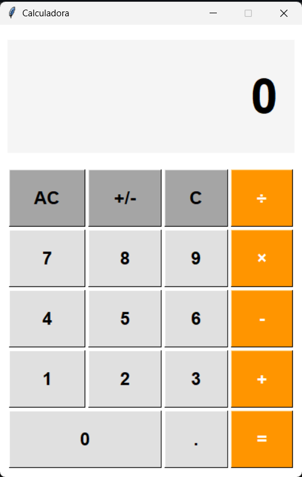
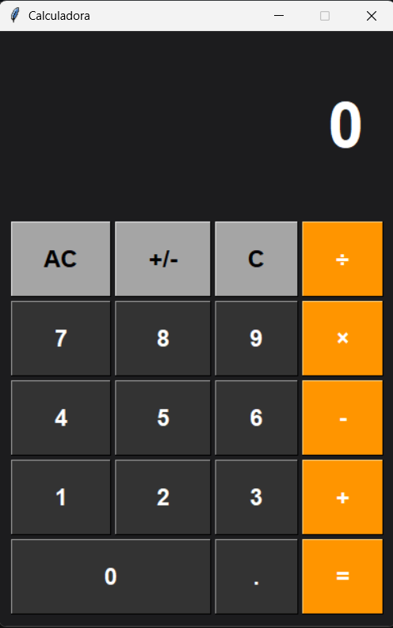

# 🧮 Calculadora en Python


## 📋 Descripción

Calculadora con interfaz gráfica desarrollada en Python utilizando la librería Tkinter. Soporta operaciones básicas, modo oscuro, atajos de teclado y manejo de errores.

> **Autor:** Javier Aram Ortega Cortez  
> **Curso:** 5to Semestre - Ingeniería en Sistemas Computacionales  
> **Tecnológico Nacional de México - Campus Matehuala**

### 🖥️ Modo Claro


### 🌙 Modo Oscuro


## ✨ Características

- ✅ Operaciones básicas: suma, resta, multiplicación, división
- ✅ **Modo oscuro** (Tecla D)
- ✅ Manejo de errores (división por cero, desbordamiento)
- ✅ Interfaz gráfica intuitiva
- ✅ **Atajos de teclado** completos

## ⌨️ Atajos de Teclado

| **Tecla** | **Acción** | **Descripción** |
|:---|:---|:---|
| `D` | Alternar tema | Cambia entre modo claro y oscuro |
| `0` - `9` | Ingresar dígitos | Escribe números en la pantalla |
| `+` | Sumar | Operación de suma |
| `-` | Restar | Operación de resta |
| `*` | Multiplicar | Operación de multiplicación (asterisco) |
| `/` | Dividir | Operación de división (slash) |
| `Enter` o `=` | Calcular | Ejecuta la operación pendiente |
| `.` | Punto decimal | Agrega punto decimal al número |
| `C` | Limpiar entrada | Borra el número actual |
| `A` | Limpiar todo (AC) | Reinicia completamente la calculadora |

## 🚀 Instalación y Uso

### Requisitos
- Python 3.6 o superior
- Tkinter (viene incluido con Python)

### Pasos para ejecutar

```bash
# Clona el repositorio
git clone https://github.com/JavierOrtegaC/calculadora-python.git

# Navega a la carpeta
cd calculadora-python

# Ejecuta la calculadora
python calculadora.py
